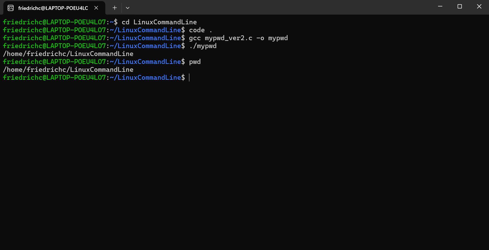

# CS-MEDIUM-03 ls命令

这是运行 `myls.c` 的结果和原生 ls 命令的结果：


显然，和原生 ls 命令相比，myls 还实现了输出**文件大小**、**文件权限**以及**最后修改时间**，展示了更为详细的文件信息。


## 对 `myls.c` 的简单解读

#### 首先是主函数部分：

```C
int main(int argc, char *argv[]) {
    if (argc < 2) {
        list_directory("."); // 默认列出当前目录
    } else {
        for (int i = 1; i < argc; i++) {
            list_directory(argv[i]);
        }
    }

    return 0;
}
```


`int main(int argc, char *argv[])` 是主函数用于接收命令行作为参数的一种原型，它有两个参数 `int argc` 和 `char *argv[]`。

其中，`argc` 表示的是命令行参数的个数，是一个整数。

`argv` 是一个**指针数组**，和二维数组在性质上相似，但实质上有所不同，可以认为是一个**字符串数组**或者**字符串向量**，这意味着，我们输入的命令行中包含有若干个字符串形式的参数，用 `argv` 这个向量就可以一一存储起来。

事实上，`argc` 这个参数并不需要主动输入，而是系统自动通过空格分隔来识别有多少参数。

假如我们输入的参数不多于一个，那就默认列出当前目录，如果多于一个，那就逐个获取这些目录下的信息。

例如，假设我在当前目录下创建了一个名为 x 的文件夹，在文件夹下创建了名为 x.txt 的空文件，并在输入命令行时写入 x ，就会产生如下效果：


#### 第二部分是获取文件信息：

```C
void list_directory(const char *path) {
    DIR *dir;
    struct dirent *entry;
    struct stat statbuf;

    if (!(dir = opendir(path))) {
        perror("opendir");
        exit(EXIT_FAILURE);
    }

    while ((entry = readdir(dir)) != NULL) {
        char full_path[1024];
        snprintf(full_path, sizeof(full_path), "%s/%s", path, entry->d_name);

        if (stat(full_path, &statbuf) == -1) {
            perror("stat");
            continue;
        }

        print_file_info(entry->d_name, &statbuf);
    }
    closedir(dir);
}
```


我们首先通过 `opendir` 打开目录，其函数原型如下：

```C
DIR *opendir(const char *name);
```

需要的头文件有 `#include <sys/types.h>`  和 `#include <dirent.h>`

很明显，其参数为一个字符串，因此我们的

```C
void list_directory(const char *path)
```

的传入参数就是一个表示目录名的字符串，这也就是主函数中 `argv` 中保存的字符串，现当作参数传入 `list_directory()`

`opendir` 的返回值是一个 `DIR` 对象，即**目录流**，然后 `readdir` 把 `DIR` 对象作为参数，返回一个 `dirent` 对象，即**目录项**，也就是目录下的子文件的信息，`dirent` 结构体中包含文件类型、大小、编号等等。

然后进入循环处理，每次循环将文件的路径和文件名写入名为 `full_path` 的缓存，然后利用 `stat()` 函数接受这个文件状态，获取文件信息，并写入 `statbuf`。

需要头文件：

```C
#include <sys/types.h>    
#include <sys/stat.h>
```

在这里，`statbuf` 是一个 `stat` 对象，之所以还要再使用 `stat` 对象，是因为这种对象的成员中包含更为详细的文件信息，如文件权限、最后修改时间等。

最后就是打印文件信息，循环继续。

之所以使用单纯的循环就可以逐个访问目录下的所有项，关键在于 `readdir()` 函数，这个函数每次调用时都会返回**目录流**中的**下一个目录项**，直到目录流的末尾，因此通过这个函数我们可以直接用循环来访问所有目录项。


#### 最后是打印文件信息的部分：

```C
void print_file_info(const char *name, struct stat *statbuf) {
    printf("%s\t", name);  //文件名
    printf("%ld\t", statbuf->st_size); // 文件大小
    printf("%o\t", statbuf->st_mode & 0777); // 文件权限（仅显示最后三位）
    // 最后修改时间
    char timebuf[80];
    strftime(timebuf, sizeof(timebuf), "%Y-%m-%d %H:%M", localtime(&statbuf->st_mtime));
    printf("%s\n", timebuf);
}
```


需要头文件 `#include <time.h>`

- 输出文件权限：

```C
printf("%o\t", statbuf->st_mode & 0777);
```

通过按位与八进制数 `777` （二进制下 `111 111 111`），我们可以获取 `st_mode` 的**低九位**，（这九位表示文件权限，而高三位表示文件类型）然后格式化输出为**三位**的八进制数。

- 输出最后一次修改时间：

```C
strftime(timebuf, sizeof(timebuf), "%Y-%m-%d %H:%M", localtime(&statbuf->st_mtime));
```

`localtime()` 函数用于将时间戳类型（`time_t`）转换为 `tm` 类型，`tm` 结构体包含年月日时分秒等成员，而函数 `strftime`  接受一个 `tm` 类型参数，格式化时间信息后，写入字符串 `timebuf` 中。


## 实现简单的 `mypwd` 函数

详细代码见 `code` 文件夹。

其中，`mypwd.c` 借助了库函数 `getcwd()` 来实现，`mypwd_ver2.c` 则参考了 `myls.c` 的思路，使用目录流操作来实现 pwd 命令。

以下是 `mypwd.c` 运行结果，与 pwd 命令相同：


以下是 `mypwd_ver2.c` 的运行结果，与 pwd 命令相同：




### 对 `mypwd_ver2.c` 的简单思路说明

首先，在 Linux 系统中，文件系统类似于树状结构，而文件就是其中的树节点，存储了文件节点的元信息的内存叫做 inode，每个文件都有对应的 inode。

而作为文件的身份标识符的是一个 `ino_t` 类型，本质上是一个无符号整型的数字，叫做 inode number。

`dirent` 结构中的 `d_ino` 成员以及 `stat` 结构中的 `st_ino` 都存储了一个文件的 inode number。

接下来具体讲代码实现，在主函数中，我们先用自定义的 `GetIno` 函数获取当前目录以及父级目录的 inode number ，如果这二者**相等**，说明我们已经到达**根目录**，可以终止目录访问，跳出循环，输出路径。

若二者不相等，则说明没有到达根节点，那就通过 `GetFileName` 获取当前目录名称，存储在一个队列中，然后跳回父级目录，继续重复上面的过程。

#### GetIno 函数

传入一个文件名信息，写入到一个 `stat` 类型的 `statbuf` 中，再返回其中存储的 inode number，比较简单。

#### GetFileName 函数

传入一个 inode name ，根据它寻找对应文件的名称。

仿照 `myls.c` 中的 `list_directory()` 函数，先打开一个目录流 `dir` ，再依次打开下属的目录项 `entry` ，寻找与传入的 inode number 匹配的文件，返回其文件名。

